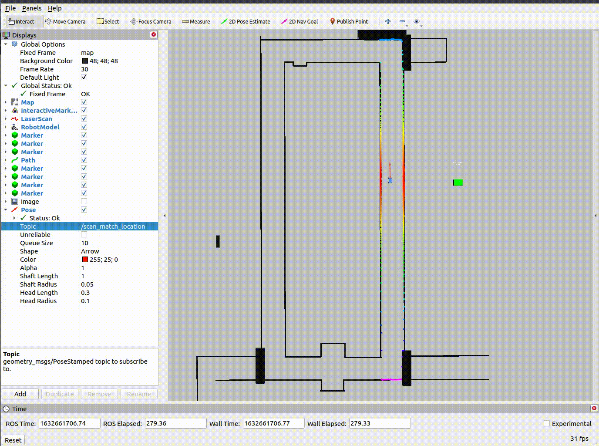

# F1tenth_lab5

This assignment from [F1TENTH](https://f1tenth.org/learn.html) practices on the most fundamental algorithms of localization, scan matching.

# How to run?
**Before cloning this respository**, make sure you have clone the [simulator](https://github.com/f1tenth/f1tenth_simulator) respository and set up the packages properly. The setup instructions can be found [here](https://f1tenth.readthedocs.io/en/stable/going_forward/simulator/sim_install.html).

> After you have clone this respository, run the script:

`roslaunch F1tenth-Lab5 scan_matching.launch`

> In RViZ, add "Pose" and add the topic /scan_match_location to view the pose estimated.

> Example Output:

## Explanation
- we have edited the function updateTransform() to find x, the optimization variable which contains the position and orientation transforms to be optimized.
- the helper functions that have been used are getX(), getY(), getNormalNorm() and greatest_real_root().
